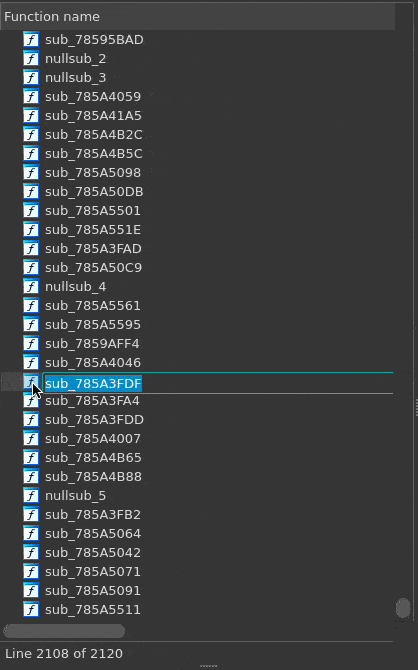
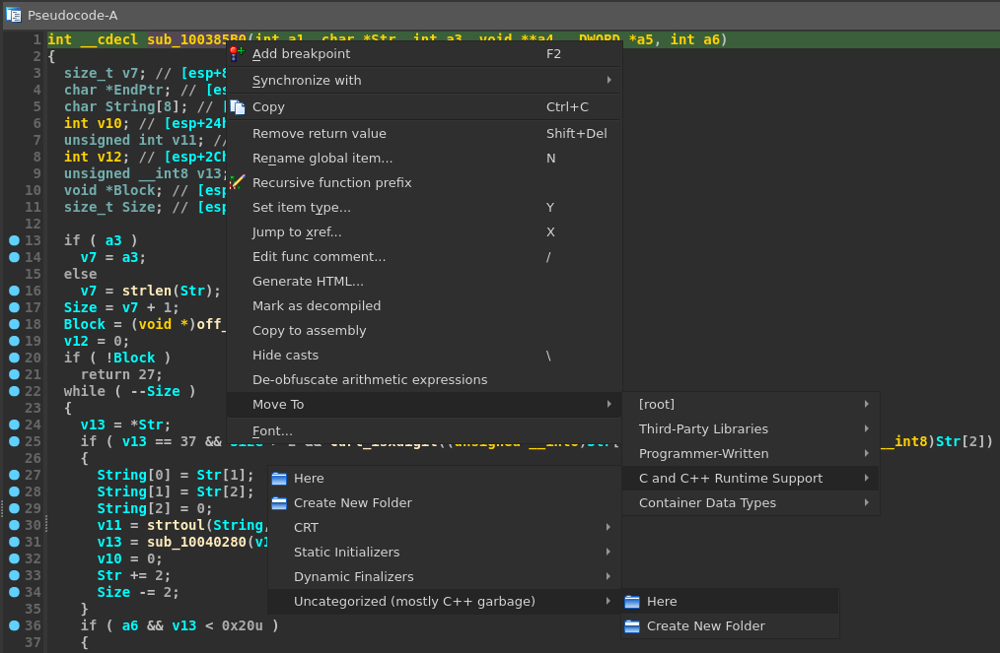

# In Too Deep
An IDAPython plugin that makes it easier to manage and use folders within IDA Pro.
  
Grouping functionality can be a great way to keep track of what's going on in a binary, but doing so in stock IDA can be tedious and unintuitive.

Spend more time on what's really important:

    
&nbsp; &nbsp; &nbsp; &nbsp;
    

# Features
- Support for multiple selections and moving folders
- Categorize any function shown in the disassembly or pseudocode windows
- Supports all native views that include folders

# Installation
Move `InTooDeep.py` to your `$IDAUSR/plugins` directory and restart IDA. Ensure that 'Show folders' is enabled in the desired view.
 

See the following KB regarding `$IDAUSR` and it's location:
https://hex-rays.com/blog/igors-tip-of-the-week-33-idas-user-directory-idausr/